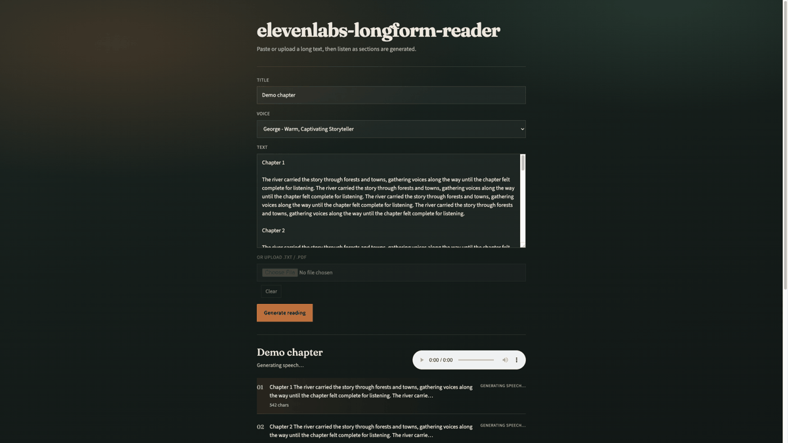
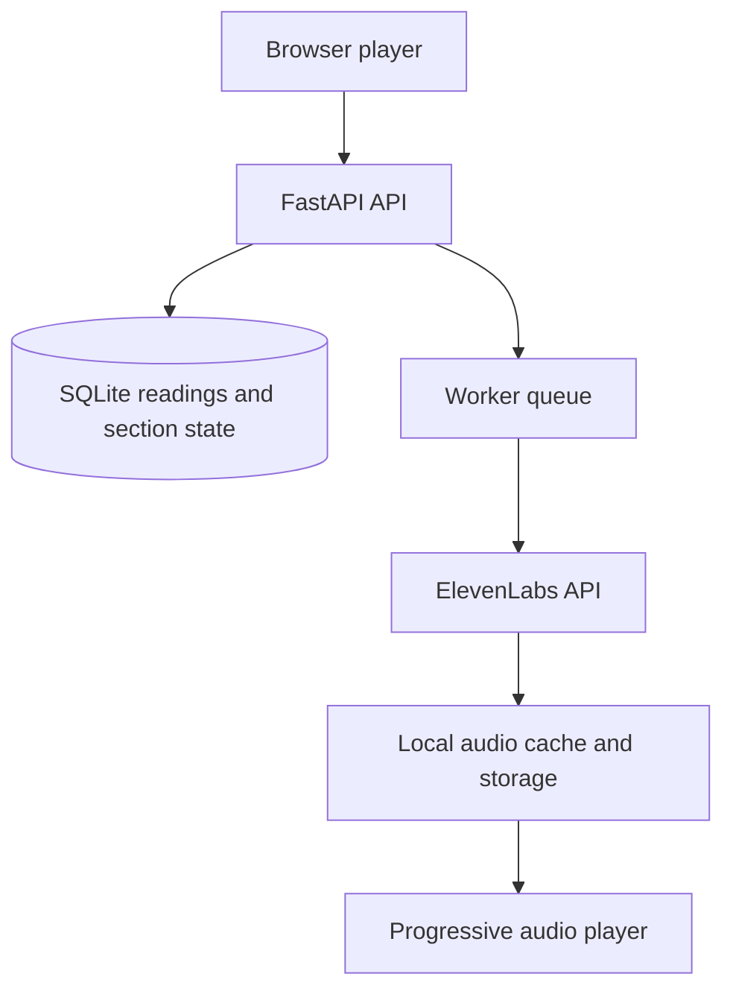

# elevenlabs-longform-reader

A production-minded prototype for turning long-form text into progressively playable audio using the ElevenLabs API.

Intended GitHub repository name: `elevenlabs-longform-reader` (local folder may still be `eleven-labs-demo`).

## Demo



Live local capture: paste text, choose a voice, generate, then listen while sections finish.

## Why this project

Long documents should become listenable before the whole document is finished. This prototype explores the practical concerns beyond a single TTS call: document chunking, progressive playback, background processing, persisted job state, content-addressed audio caching, retries, and restart recovery.

## Architecture



Path in words: Browser → FastAPI → SQLite → background worker → ElevenLabs → cache/storage → progressive player.

## Key design decisions

- **Chunking and heading preservation** — split at paragraph boundaries, keep headings with following content, respect section size caps, and hard-split oversized units safely.
- **Background generation** — readings enqueue into an in-process asyncio worker so early sections can finish while later ones continue.
- **Progressive playback** — the UI polls section status and starts audio when the first section is ready.
- **Content-addressed caching** — identical voice/model/text hashes share one cached MP3; concurrent writers use per-key locks and atomic renames.
- **Persisted states** — readings and sections live in SQLite with attempt counts and retry timestamps for transient failures.
- **Startup recovery** — unfinished `pending` / stuck `processing` work is re-enqueued when the process starts (a durable external queue is the production evolution).

## Production considerations

This is a **local single-process prototype**. The in-memory queue is recovered on startup but is not a multi-worker durable system. There is no auth, multi-tenant isolation, or object-storage delivery. Treat it as an engineering showcase, not a production deployment.

Hardening for a real deployment:

- Durable queue (Redis + Celery / Dramatiq / ARQ)
- Retries / backoff (already prototyped in-process with DB persistence)
- Rate limiting and authentication
- Object storage + CDN (or signed URLs) instead of local disk
- Postgres instead of SQLite
- Metrics, tracing, and structured logs (basic in-process metrics are exposed at `/api/metrics`)

The demo can remain unauthenticated locally. A public deployment needs at least:

- Authentication / authorization
- Per-user quotas
- Rate limiting
- Request size limits (already configurable here)
- Abuse prevention for uploaded content
- Private audio URLs or object-storage signed URLs
- Secure secrets management (no `load_dotenv(override=True)`; pydantic-settings owns env loading)
- Audit logging appropriate for user-uploaded content


## Requirements

- Python 3.14+
- [Pipenv](https://pipenv.pypa.io/)
- An [ElevenLabs](https://elevenlabs.io/) API key

## Setup

```bash
cd eleven-labs-demo
PIPENV_VENV_IN_PROJECT=1 pipenv install --dev
cp .env.example .env
make install-hooks
```

Edit `.env` and set your key:

```
ELEVENLABS_API_KEY=your_real_key
```

Optional settings (see `.env.example`):

- `ELEVENLABS_VOICE_ID`, `ELEVENLABS_MODEL_ID`
- `ELEVENLABS_TEST_API_KEY` — optional live test key (never use the production key in tests)
- `MEDIA_ROOT`, `DATABASE_URL`
- `REQUEST_TIMEOUT_SECONDS`, `MAX_ATTEMPTS`, backoff settings
- `MAX_UPLOAD_BYTES`, `MAX_TEXT_CHARS`, `MAX_SECTIONS`, `ALLOWED_CONTENT_TYPES`

## Run

```bash
make serve
# or: pipenv run serve
```

Open [http://127.0.0.1:8000](http://127.0.0.1:8000). API docs: [http://127.0.0.1:8000/docs](http://127.0.0.1:8000/docs).

| Command | What it does |
|---------|----------------|
| `serve` | Start uvicorn with reload |
| `lint` / `fmt` / `lint-fixup` | Ruff |
| `test` | Full pytest suite |
| `test-unit` | Mocked tests only |
| `test-live` | Live ElevenLabs (`ELEVENLABS_TEST_API_KEY`) |
| `check` | Lint + mocked tests |
| `cov` | Coverage report for mocked suite |
| `install-hooks` | Pre-commit: `fmt`, `lint`, `test-unit` |

## Testing

```bash
make test-unit
# or: pipenv run pytest -m "not integration"

make test-live
# requires ELEVENLABS_TEST_API_KEY

make cov
```

## Usage

1. Paste text **or** upload a `.txt` / `.pdf` (inputs are mutually exclusive in the UI).
2. Pick a voice and submit.
3. The app splits the document into listening-sized sections and generates speech asynchronously.
4. Playback starts when the first section is ready; later sections keep generating in the background.

Audio lives under `media/audio/` (per-reading folders plus `_cache/`). Metadata is in SQLite under `data/`.

## API

| Method | Path | Description |
|--------|------|-------------|
| `POST` | `/api/readings` | Create a reading from `text` or uploaded `file` |
| `GET` | `/api/readings/{id}` | Reading status and sections |
| `GET` | `/api/readings/{id}/sections/{index}/audio` | Stream a ready MP3 section |
| `GET` | `/api/voices` | List available ElevenLabs voices |
| `GET` | `/api/metrics` | In-process counters (demo observability) |

### Example: create from pasted text

```bash
curl -s -X POST http://127.0.0.1:8000/api/readings \
  -F 'text=Chapter 1

Once upon a time in a long document…' \
  -F 'title=Demo chapter'
```

Example response (shape):

```json
{
  "id": 1,
  "title": "Demo chapter",
  "status": "queued",
  "section_count": 1,
  "total_char_count": 52,
  "sections": [
    {
      "id": 1,
      "index": 0,
      "status": "pending",
      "char_count": 52,
      "preview": "Chapter 1\n\nOnce upon a time…"
    }
  ]
}
```

### Example: poll status

```bash
curl -s http://127.0.0.1:8000/api/readings/1
```

### Example: stream audio when ready

```bash
curl -OJ http://127.0.0.1:8000/api/readings/1/sections/0/audio
```

## License

MIT — see [LICENSE](LICENSE).
